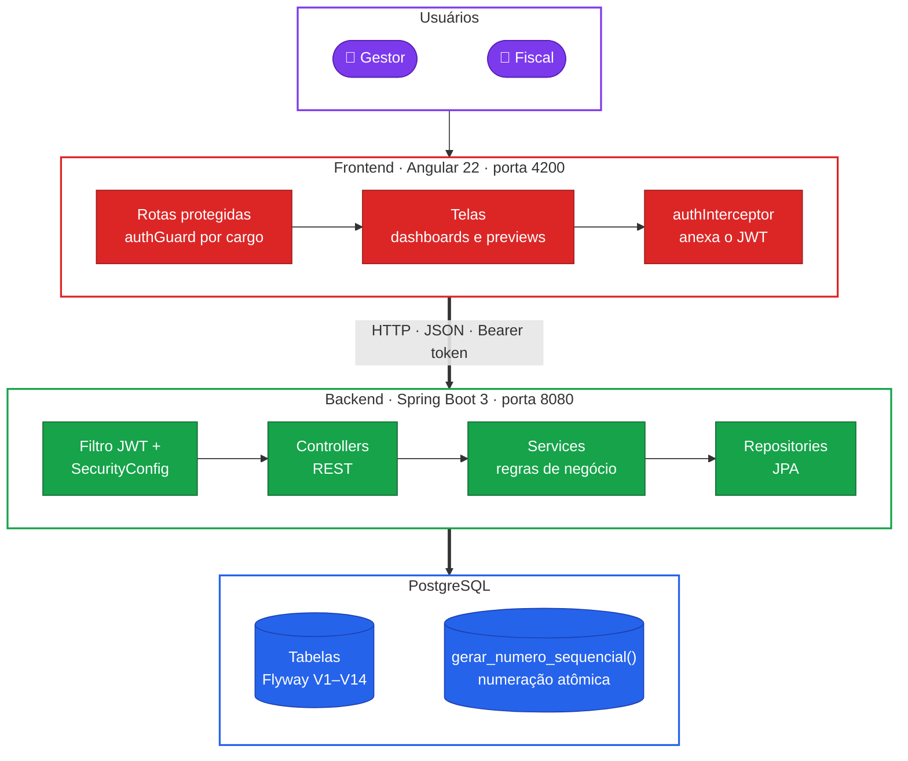
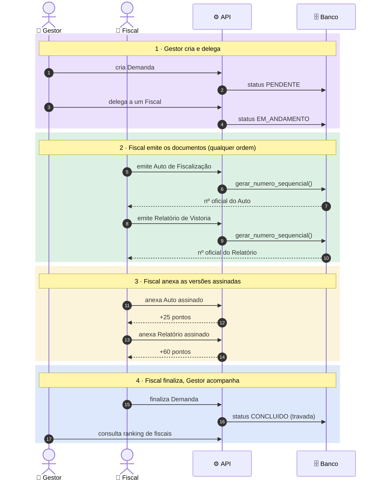
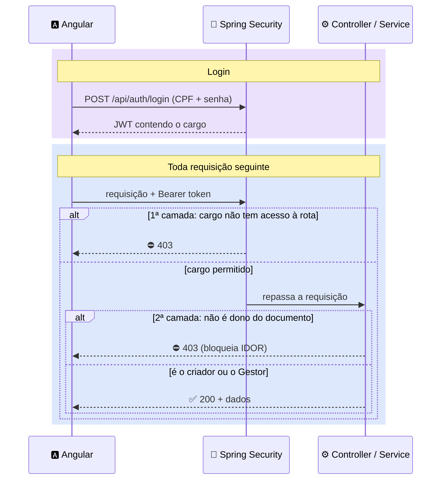
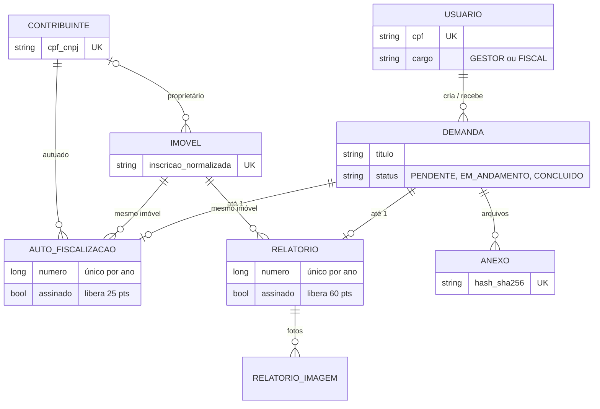
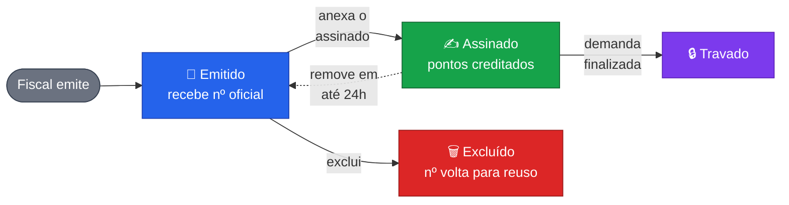

# Módulo de Fiscalização Ambiental

## O que é este projeto

Aplicação web full-stack de controle processual e fluxo de tarefas, inspirada livremente na
estrutura de dados e no fluxo de trabalho do sistema público real **SEMAC** (Secretaria Municipal
do Meio Ambiente e do Cuidado Animal), construída do zero como peça de portfólio
técnico — **sem reutilização de código ou dados reais** daquele sistema, só de padrões de
arquitetura.

Simula o dia a dia de um órgão de fiscalização ambiental: um **Gestor** cria demandas de
fiscalização e delega a um **Fiscal**, que executa a vistoria em campo e emite os documentos
oficiais (Auto de Fiscalização e Relatório de Vistoria) com numeração sequencial legítima, anexa
a versão assinada de cada um, acumula pontos de produtividade, e finaliza a demanda quando tudo
está concluído.

Foi pensado para demonstrar, domínio prático de **Angular** + **Spring
Boot** + **PostgreSQL**, com ênfase em pontos técnicos reais: autenticação stateless via JWT com
controle de acesso por cargo (RBAC) em duas camadas, geração de numeração sequencial **atômica**
(sem condição de corrida, mesmo com dois fiscais emitindo documentos no mesmo milissegundo), e
uma boa quantidade de regras de negócio não triviais construídas e corrigidas de forma iterativa,
detalhadas mais abaixo.

## Visão geral em um diagrama
Como uma ação na tela atravessa o sistema inteiro, do navegador até o banco:



## Como rodar o projeto

### Pré-requisitos
- Java 21
- Node.js + npm
- PostgreSQL rodando localmente, com um banco chamado `semac_portfolio`

> O `pom.xml` do backend declara `<java.version>25</java.version>`, mas nem sempre há um JDK 25
> instalado no ambiente — por isso o comando abaixo sempre sobrescreve para `21` na linha de
> comando (`-Djava.version=21`), que é o que realmente roda.

### Banco de dados
Crie o banco `semac_portfolio` e ajuste usuário/senha em
`Fiscal-Ambiental/src/main/resources/application.properties` se precisar:
```properties
spring.datasource.url=jdbc:postgresql://localhost:5432/semac_portfolio
spring.datasource.username=postgres
spring.datasource.password=Demo@123
```
Ao subir o backend pela primeira vez, o Flyway aplica automaticamente todas as migrações (`V1` a
`V14`) e popula os 3 usuários de demonstração.

### Subir o backend
```bash
cd Fiscal-Ambiental
./mvnw spring-boot:run -Djava.version=21
```
API em `http://localhost:8080`.

### Subir o frontend
```bash
cd fiscal-ambiental-frontend
npx ng serve --port 4200
```
Aplicação em `http://localhost:4200`.

### Contas de demonstração
| Cargo | CPF | Senha |
|---|---|---|
| Gestor | `00000000000` | `Demo@123` |
| Fiscal (Carlos) | `11111111111` | `Demo@123` |
| Fiscal (Mariana) | `22222222222` | `Demo@123` |

## Tecnologias

**Backend**
- Java 21, Spring Boot 3.2.5
- Spring Security + JWT (autenticação stateless, sem sessão de servidor)
- Spring Data JPA / Hibernate
- PostgreSQL + Flyway (14 migrações versionadas, o histórico real de como o schema evoluiu)
- Maven

**Frontend**
- Angular 22, componentes *standalone*, *zoneless change detection* (sem Zone.js — toda
  atualização de estado assíncrona precisa de `ChangeDetectorRef.markForCheck()` manual)
- TypeScript + RxJS
- CSS puro, sem framework de UI (glassmorphism, gradientes, tema escuro)
- Sem biblioteca de gráficos: o gráfico de pontuação diária é um bar chart feito só com CSS/HTML

## Estrutura de pastas

```
Módulo de Fiscalização Ambiental/
├── Fiscal-Ambiental/              → backend (Spring Boot)
├── fiscal-ambiental-frontend/     → frontend (Angular)
├── requisitos/                    → 10 fichas de requisito formais (ISO/IEC/IEEE 29148)
├── SRS_MODULO_FISCALIZACAO_AMBIENTAL_v1.0.md   → especificação de requisitos completa
└── README.md                      → este arquivo
```

### `Fiscal-Ambiental/` (backend)
```
src/main/java/com/portifolio/fiscalambiental/
├── controller/    → endpoints REST: AuthController, GestorController, FiscalController,
│                    AutoFiscalizacaoController, RelatorioController, ImovelController,
│                    ContribuinteController, AnexoController, UsuarioController
├── service/       → toda a regra de negócio vive aqui, nunca no controller
├── repository/    → interfaces Spring Data JPA (uma por entidade)
├── model/         → entidades JPA (Usuario, Demanda, AutoFiscalizacao, Relatorio,
│                    RelatorioImagem, Contribuinte, Imovel, Anexo)
├── security/      → filtro JWT, geração/validação de token, configuração do Spring Security
└── exception/     → tratamento global de erro de validação (Bean Validation)
src/main/resources/
├── application.properties
└── db/migration/  → V1 a V14, aplicadas automaticamente pelo Flyway a cada subida
```

### `fiscal-ambiental-frontend/` (frontend)
```
src/app/
├── components/    → uma pasta por tela/peça de UI: login, gestor-dashboard, fiscal-dashboard,
│                    minha-pontuacao, documentos, auto-preview, relatorio-preview,
│                    documento-header, documento-assinado-upload
├── services/      → um serviço HTTP por domínio (auto, relatorio, imovel, contribuinte,
│                    demanda, anexo, usuario, auth) + o interceptor que injeta o JWT
├── guards/        → authGuard, bloqueia rota por cargo (Gestor/Fiscal)
└── models/        → interfaces TypeScript espelhando os DTOs do backend
```

### `requisitos/`
10 fichas de requisito individuais (formato ISO/IEC/IEEE 29148), cada uma com critérios de
aceite verificáveis e o status real de implementação — ver a tabela na seção "Documentação
formal" abaixo.

## Perfis de usuário

O sistema tem dois cargos, cada um com seu próprio painel e rotas protegidas separadamente
(`/api/gestor/**` só aceita `GESTOR`, `/api/fiscal/**` só aceita `FISCAL` — reforçado tanto no
Spring Security quanto no `authGuard` do Angular):

**Gestor**
- Cria Demandas de Fiscalização e delega a um Fiscal ativo.
- Acompanha todas as demandas (`/gestor`) e todos os documentos emitidos por todos os fiscais
  (`/documentos`).
- Vê o ranking de produtividade de todos os fiscais.
- Não emite Auto/Relatório nem altera documentos de um Fiscal.

**Fiscal**
- Vê só as Demandas atribuídas a ele, divididas em abas "Fila de Trabalho" e "Concluídas".
- Emite o Auto de Fiscalização e o Relatório de Vistoria de cada demanda (no máximo um de cada).
- Anexa a versão assinada de cada documento, o que libera a pontuação de produtividade.
- Finaliza a demanda quando os dois documentos estão emitidos e assinados.
- Acompanha sua própria pontuação em `/minha-pontuacao`: total, gráfico diário e lista de
  documentos.
- Só vê/edita/exclui os documentos que ele mesmo emitiu — nunca os de outro fiscal, checado no
  backend (não só escondido na tela).

## Como o sistema funciona (fluxo ponta a ponta)



O ciclo de vida de uma Demanda, resumido:


1. **Gestor cria uma Demanda** (título, descrição, localização/urgência opcionais) e delega a um
   Fiscal ativo — o status passa de `PENDENTE` para `EM_ANDAMENTO`.
2. **Fiscal abre a fila de trabalho**, seleciona a demanda, e emite o **Auto de Fiscalização**
   e/ou o **Relatório de Vistoria** — qualquer um dos dois pode ser feito primeiro. Cada um
   recebe um número sequencial oficial, único por tipo e por ano, gerado atomicamente pelo banco.
   - Se o Contribuinte ou o Imóvel já existem (buscados por nome/CPF-CNPJ ou por inscrição), o
     fiscal reaproveita o cadastro em vez de digitar tudo de novo, e pode corrigir dados
     desatualizados nesse momento.
   - O Auto e o Relatório de uma mesma demanda são obrigados a apontar para o mesmo Imóvel.
3. **Fiscal anexa o documento assinado** (o PDF/imagem do papel impresso, assinado à mão e
   digitalizado) em cada documento emitido — isso é o que efetivamente libera a pontuação (25 pts
   por Auto, 60 por Relatório). Emitir sozinho não pontua.
   - Dentro de 24h do anexo, o fiscal ainda pode remover o documento assinado (e perde a
     pontuação de volta) para corrigir algo.
4. **Fiscal finaliza a demanda** quando o Auto e o Relatório já estão emitidos e ambos com o
   documento assinado anexado. A partir daí nada mais pode ser alterado, e a demanda sai da fila
   ativa e passa a viver na aba "Concluídas".
5. Em paralelo, o **Gestor** acompanha tudo em `/gestor` (visão geral, ranking de fiscais) e em
   `/documentos` (todos os Autos/Relatórios emitidos no sistema, de qualquer fiscal).

## Arquitetura e segurança

- **Backend em camadas**: `Controller → Service → Repository → Model`. Regra de negócio nunca
  fica em controller nem em repository — sempre no service.
- **Autenticação**: login por CPF+senha (`POST /api/auth/login`) devolve um JWT stateless
  (`Authorization: Bearer <token>`), sem sessão de servidor. O token carrega o cargo do usuário.
- **Autorização em duas camadas**: `SecurityConfig` bloqueia por padrão de rota
  (`/api/gestor/**` exige `GESTOR`, `/api/fiscal/**` exige `FISCAL`), e dentro dos services ainda
  existe uma segunda checagem de **posse** — um Fiscal só edita/exclui/lê os documentos que ele
  mesmo criou, mesmo em rotas que não são exclusivas de um cargo (ex.: `GET /api/autos/{id}` é
  acessível a qualquer usuário autenticado, mas o próprio endpoint verifica se quem está pedindo
  é o Gestor ou o criador daquele documento específico).



- **Numeração sequencial atômica**: cada Auto/Relatório recebe um número único por tipo+ano,
  gerado por uma função nativa do PostgreSQL (`gerar_numero_sequencial`) chamada dentro de uma
  transação, garantindo que dois fiscais emitindo documentos ao mesmo tempo nunca recebam o mesmo
  número — mesmo sob concorrência real (testado com 20 requisições simultâneas, zero colisões,
  documentado em `REQ-DESEMP-001`). Números de documentos excluídos voltam para uma fila de reuso
  (`numeros_descartados`) em vez de serem desperdiçados.
- **Migrações versionadas**: todo o histórico de evolução do schema está em `db/migration/V1` a
  `V14`, aplicado automaticamente pelo Flyway a cada subida.

## Modelo de dados (entidades principais)

| Entidade | O que representa |
|---|---|
| `Usuario` | Gestor ou Fiscal (cargo, CPF, senha com hash bcrypt) |
| `Demanda` | Tarefa de fiscalização criada pelo Gestor e delegada a um Fiscal |
| `AutoFiscalizacao` | Auto de Fiscalização emitido pelo Fiscal para uma Demanda |
| `Relatorio` | Relatório de Vistoria emitido pelo Fiscal para uma Demanda, com fotos (`RelatorioImagem`) |
| `Contribuinte` | Pessoa física/jurídica autuada — CPF/CNPJ é o identificador único |
| `Imovel` | Imóvel vistoriado — inscrição é o identificador único (normalizada sem pontos) |
| `Anexo` | Arquivo (foto/PDF) anexado a uma Demanda, deduplicado por hash SHA-256 |

Um Auto e um Relatório sempre pertencem a exatamente uma Demanda (no máximo 1 de cada), e sempre
apontam para o mesmo Imóvel quando emitidos para a mesma Demanda.



## Documentação formal

- [`SRS_MODULO_FISCALIZACAO_AMBIENTAL_v1.0.md`](./SRS_MODULO_FISCALIZACAO_AMBIENTAL_v1.0.md) —
  Especificação de Requisitos de Software completa, formato ISO/IEC/IEEE 29148:2018: propósito,
  escopo, requisitos funcionais/não-funcionais e histórico de revisões, incluindo bugs reais
  encontrados durante a verificação de cada requisito.
- [`requisitos/`](./requisitos/) — 10 fichas de requisito individuais, cada uma com critérios de
  aceite verificáveis:

  | Ficha | Nome |
  |---|---|
  | `REQ-FUNC-001` | Autenticação de usuário com emissão de token JWT |
  | `REQ-FUNC-002` | Criação de Demanda de Fiscalização pelo Gestor |
  | `REQ-FUNC-003` | Delegação de Demanda a um Fiscal |
  | `REQ-FUNC-004` | Emissão de Auto de Fiscalização pelo Fiscal |
  | `REQ-FUNC-005` | Emissão de Relatório de Vistoria pelo Fiscal |
  | `REQ-FUNC-006` | Upload de anexo com verificação de duplicidade por hash |
  | `REQ-SEG-001` | Controle de acesso baseado em cargo (RBAC) |
  | `REQ-SEG-002` | Armazenamento seguro de senha do usuário |
  | `REQ-DESEMP-001` | Numeração sequencial atômica sob concorrência |
  | `REQ-DESEMP-002` | Bloqueio client-side de upload de arquivo duplicado |

## Regras de negócio

### Já existentes desde a concepção original

Fazem parte do desenho original do projeto, documentadas no SRS e nas fichas de requisito:

- **RBAC por cargo**: Gestor e Fiscal têm rotas e telas completamente separadas.
- **Numeração sequencial atômica** — ver "Arquitetura e segurança" acima.
- **Senha com hash bcrypt**, nunca armazenada nem devolvida em texto puro
  (`@JsonProperty(access = WRITE_ONLY)` em `Usuario.senhaHash`).
- **Deduplicação de anexo por hash SHA-256**: calculado no navegador (Web Crypto API) antes do
  upload — se o hash já existe no backend, a requisição de upload nem sai da máquina do cliente.
- **Pontuação de produtividade fixa por tipo de documento** (25 pts Auto, 60 pts Relatório),
  nunca decidida pelo Fiscal.

### Criadas/ajustadas nesta fase de desenvolvimento

A emissão de documentos evoluiu bastante ao longo do desenvolvimento. Resumo do que foi
construído (o detalhe técnico completo de cada item, com referência de arquivo, está nas
subseções logo abaixo):

1. Um Auto e um Relatório por Demanda, no máximo.
2. Auto e Relatório de uma mesma Demanda compartilham obrigatoriamente o mesmo Imóvel.
3. Edição do Imóvel/Contribuinte com reaproveitamento inteligente entre demandas.
4. Inscrição do Imóvel normalizada (sem pontos), pra nunca duplicar um cadastro por formatação.
5. Sugestão de Imóveis ao selecionar um Contribuinte já cadastrado, e troca de Contribuinte de um
   Imóvel sem nunca excluir o antigo.
6. Documento assinado condiciona a pontuação (emitir não pontua; anexar assinado, sim).
7. Exclusão de Auto/Relatório com reuso do número sequencial.
8. Finalizar Demanda: trava em definitivo os documentos de uma demanda concluída.
9. Aba "Concluídas" na fila de trabalho do Fiscal.
10. Página "Minha Pontuação" do Fiscal, com gráfico diário de produtividade.
11. Correção de uma falha de segurança (IDOR) nas rotas de leitura de documento.

---

#### 1–2. Um Auto e um Relatório por Demanda, sempre no mesmo Imóvel

Antes era possível emitir vários Autos/Relatórios para a mesma demanda. Agora o backend recusa a
segunda emissão (`existsByDemandaId`) e orienta a editar a existente. E os dois documentos de uma
mesma demanda são obrigados a compartilhar o mesmo Imóvel: se o Relatório já existe quando o Auto
é emitido, o Auto reaproveita o Imóvel do Relatório (e completa o Contribuinte nele, se ainda não
tinha); e vice-versa.

Referências de código: `existsByDemandaId` e `resolverImovelCompartilhado` em
`AutoFiscalizacaoService`/`RelatorioService`.

#### 3–5. Edição de Imóvel/Contribuinte: dentro da mesma demanda vs. entre demandas diferentes

**Dentro da mesma demanda**: o Imóvel só pode ser editado através do documento que o originou (o
primeiro dos dois que foi emitido). O segundo documento tem os campos de Imóvel travados na tela.

- **Por quê:** isso obriga o fiscal a voltar no documento original para corrigir o Imóvel, o que
  o lembra de que precisa baixar/reimprimir aquele documento de novo com a informação atualizada.
  Se a edição fosse permitida pelo segundo documento, o dado seria corrigido sem que o fiscal
  percebesse que o primeiro documento (já talvez impresso/assinado) ficou desatualizado.

**Entre demandas diferentes**: quando um Imóvel ou Contribuinte já cadastrado é localizado pela
busca para reaproveitar em uma nova demanda, ele pode ser editado/atualizado livremente nesse
reaproveitamento — porque endereços mudam de verdade com o tempo, e alguém pode notar um erro de
cadastro.

- `ImovelService.buscarOuCriar` e `ContribuinteService.buscarOuCriar` distinguem **como** o
  registro foi encontrado: se veio de uma seleção explícita pela busca (o formulário carrega o
  `id` do registro escolhido), os dados digitados **atualizam** o cadastro existente. Se veio só
  de uma inscrição/CPF digitado manualmente que por coincidência bateu com um já cadastrado (sem
  passar pela busca, sem `id`), o Imóvel **não é sobrescrito** — só reaproveitado, completando o
  Contribuinte se estiver vazio (para Contribuinte, como CPF/CNPJ não tem a mesma ambiguidade de
  formatação que a inscrição do Imóvel, qualquer forma de match já atualiza o cadastro; o próprio
  CPF/CNPJ nunca é alterado por esse caminho).
- A inscrição do Imóvel pode ser digitada com ou sem pontos (`012.045.0023.01` vs
  `012045002301`) — uma coluna `inscricao_normalizada` (sem pontos, `UNIQUE` no banco) garante
  que as duas formas sejam tratadas como o mesmo imóvel em toda busca/verificação de duplicidade
  (migração `V14`).
- Ao selecionar um Contribuinte já cadastrado no formulário do Auto, o sistema sugere os Imóveis
  que ele já possui. Trocar o Contribuinte de um Imóvel só troca a FK — o Contribuinte antigo
  nunca é excluído, e outros documentos que já o referenciam não são afetados.
- Na tela, ao reaproveitar um registro pela busca aparece o aviso "Reaproveitando um
  [imóvel/contribuinte] já cadastrado — os dados abaixo vão atualizar esse cadastro", com um
  botão para desfazer a seleção caso o fiscal tenha escolhido o item errado.

Referências de código: `ImovelService`/`ContribuinteService` (`buscarOuCriar`,
`aplicarEdicoes`, `normalizarInscricao`, `buscarPorContribuinte`); `resolverImovelCompartilhado`
em `AutoFiscalizacaoService`/`RelatorioService`; `ImovelFormState`/`ContribuinteFormState` e os
getters `imovelBloqueadoAuto`/`imovelBloqueadoRelatorio` em `fiscal-dashboard.component.ts`.

#### 6–7. Documento assinado, pontuação e exclusão

A pontuação só é concedida quando o documento assinado (o papel impresso, assinado e
digitalizado) é anexado — emitir o Auto/Relatório sozinho não pontua. Dentro de 24h do anexo, o
fiscal ainda pode removê-lo (e perde a pontuação de volta) para corrigir algo. Um documento
(Auto ou Relatório) só pode ser excluído enquanto não tiver o documento assinado anexado; ao
excluir, o número sequencial volta para a fila de reuso do banco (`numeros_descartados`) em vez
de ser desperdiçado.



Referências de código: `anexarDocumentoAssinado`/`removerDocumentoAssinado`/`excluirAuto`/
`excluirRelatorio` em `AutoFiscalizacaoService`/`RelatorioService`; `NumeracaoService.descartarNumero`.

#### 8–9. Finalizar Demanda e a aba "Concluídas"

O Fiscal pode finalizar uma Demanda quando o Auto **e** o Relatório já foram emitidos e **os
dois** já têm o documento assinado anexado. Ao finalizar:
- O status da Demanda muda para `CONCLUIDO` (e `dataConclusao` é preenchida).
- Nenhuma alteração é mais aceita nos documentos dessa demanda — bloqueado no backend, não só
  escondido na tela (`validarDemandaNaoConcluida`, chamado no início de todo método que muta um
  Auto/Relatório).
- O Gestor também não consegue mais editar, excluir ou redelegar a demanda — já garantido pelos
  checks de status que já existiam em `GestorController`.
- A demanda some da "Fila de Trabalho" e passa a viver numa aba separada "Concluídas" — fica lá
  guardada, sem competir visualmente com o trabalho ainda em aberto (filtro 100% client-side:
  `demandasAtivas`/`demandasConcluidas` são getters derivados por `status`).

Referências de código: `FiscalController.finalizarDemanda`; `demandaConcluida`/
`podeFinalizarDemanda`/`abaAtiva`/`demandasAtivas`/`demandasConcluidas` em
`fiscal-dashboard.component.ts`; `@Input() bloqueado` em `DocumentoAssinadoUploadComponent`.

#### 10. Página "Minha Pontuação"

Página `/minha-pontuacao` do Fiscal (ícone na sidebar, abre em nova aba): total de pontos,
documentos assinados, gráfico de barras dos últimos 14 dias e a lista dos documentos que geraram
pontos.

- **A data que conta é a da assinatura, não a de emissão** — os pontos só passam a valer quando o
  documento assinado é anexado, e um documento pode ficar dias emitido e sem assinar. O
  agrupamento por dia usa `documentoAssinadoEnviadoEm`, então reflete exatamente o dia em que a
  pontuação foi de fato creditada, e some sozinho do gráfico se o fiscal remover o documento
  assinado depois (o cálculo é sempre ao vivo, sem um "livro-razão" separado).
- O gráfico usa componentes **locais** da data (`getFullYear`/`getMonth`/`getDate`) para montar a
  chave de cada dia, nunca `toISOString()` — que converte pra UTC e, à noite num fuso negativo
  (o servidor roda em UTC-3), já "vira o dia" antes da meia-noite local, desalinhando a barra da
  data mostrada embaixo dela.

Referências de código: `FiscalController.minhaPontuacao` (`GET /api/fiscal/minha-pontuacao`);
`MinhaPontuacaoComponent`.

#### 11. Correções de segurança e integridade (varredura de bugs)

Numa revisão geral, quatro problemas reais foram encontrados e corrigidos:

1. **IDOR nas rotas de leitura de Auto/Relatório.** `/api/fiscal/{autos,relatorios}/por-demanda/{id}`,
   `/api/autos/{id}`, `/api/relatorios/{id}` e as versões `/documento-assinado` (download do PDF
   assinado) não checavam posse — qualquer usuário autenticado (inclusive outro Fiscal)
   conseguia ler/baixar documentos de demandas alheias só sabendo o ID. Confirmado ao vivo com
   duas contas reais antes de corrigir. Agora: Gestor continua vendo tudo (tela "Documentos
   Emitidos"), Fiscal só o que ele mesmo emitiu.
2. **Reaproveitar Contribuinte nunca aplicava correções** — o mesmo mecanismo que já existia para
   Imóvel não tinha sido estendido para Contribuinte.
3. **`excluirDemanda` sem checar Auto/Relatório existentes** — podia cair num erro 500 cru de
   violação de chave estrangeira em vez de uma mensagem amigável.
4. **Contribuinte podia ser salvo sem CPF/CNPJ** — dependia só do `required` do formulário, sem
   nenhuma validação no backend.

Referências de código: `AutoFiscalizacaoController`/`RelatorioController.validarAcesso`;
`FiscalController.validarPosseDaDemandaPorId`; `GestorController.excluirDemanda`;
`ContribuinteService.buscarOuCriar`/`aplicarEdicoes`.
