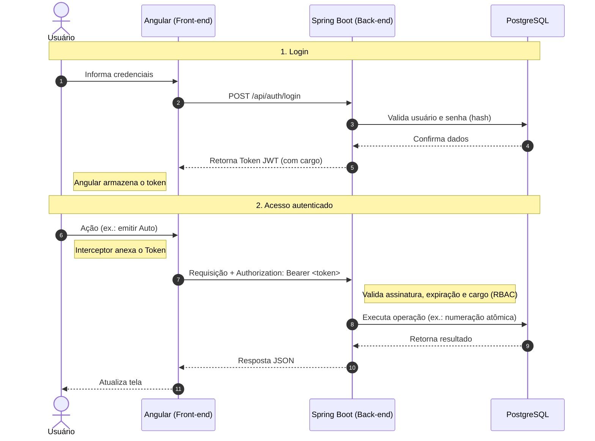

# Especificação de Requisitos de Software (SRS)

> **Norma de referência:** ISO/IEC/IEEE 29148:2018
> **Projeto:** `Módulo de Fiscalização Ambiental`
> **Versão:** `1.3`
> **Data:** `22/09/2026`
> **Autor:** `Luiza`

---

## Histórico de Revisões

| Versão | Data | Autor | Alterações |
|--------|------|-------|------------|
| 1.0 | 10/09/2026 | Luiza | Rascunho inicial, consolidado a partir do código-fonte implementado até então e do plano de estudos que originou o projeto |
| 1.1 | 11/09/2026 | Luiza | Atualização pós-verificação das fichas de requisito (`REQ-SEG-001`, `REQ-SEG-002`, `REQ-FUNC-006`), com bugs reais encontrados e corrigidos: (a) bypass de RBAC via rotas redundantes — `DemandaController` removido, `POST` duplicado removido de `AutoFiscalizacaoController`/`RelatorioController`, `@PreAuthorize` adicionado em `AnexoController`/`UsuarioController`; (b) ausência de validação de senha na criação de usuário (Bean Validation + handler global de erro); (c) contrato divergente entre frontend e backend no upload de anexo e na checagem de duplicidade por hash (corrigido e revalidado pela tela real). Também reflete o redesign visual do Login e do Painel do Gestor, e a padronização da senha de demonstração dos usuários seed. |
| 1.2 | 13/09/2026 | Luiza | Verificação completa das 10 fichas de requisito (`requisitos/`), com gaps reais encontrados e corrigidos: (a) token JWT expirado guardado no navegador derrubava qualquer requisição, inclusive o próprio login (`JwtAuthenticationFilter` não tratava a exceção); (b) delegação de Demanda não validava cargo/status ativo do destinatário nem impedia redelegar uma demanda já em andamento; (c) **emissão de Auto e de Relatório de Fiscalização estava quebrada de ponta a ponta** — não havia forma de cadastrar Contribuinte/Imóvel, e o Relatório enviava o ID da Demanda no lugar do ID do Imóvel; (d) nenhuma das duas emissões verificava se a Demanda pertencia ao Fiscal autenticado. Numeração sequencial atômica testada sob concorrência real pela primeira vez (20 requisições simultâneas, zero colisões). Também reflete o segundo redesign visual (tema escuro/vibrante com gradientes, aplicado a Login, Painel do Gestor **e agora também ao Painel do Fiscal**, substituindo o layout claro da v1.1). |
| 1.3 | 22/09/2026 | Luiza | Documento realinhado ao estado real do sistema após uma fase adicional de desenvolvimento (migrações V6–V14): upload de documento assinado (Auto/Relatório) com pontuação de produtividade condicionada a ele; edição/exclusão de Auto e Relatório pelo próprio fiscal criador; fila de trabalho do Fiscal dividida em "Ativas"/"Concluídas" com endpoint de finalização de demanda; página "Minha Pontuação" com gráfico diário; `ContribuinteController`/`ImovelController` (busca) criados; reaproveitamento de Contribuinte/Imóvel com edição controlada; normalização de inscrição de imóvel (com/sem pontos); exclusão de Auto/Relatório com reuso do número descartado (bug de `V4` corrigido em `V13`); e a correção de uma vulnerabilidade real de IDOR — leitura de Auto/Relatório por ID deixou de ser aberta a "qualquer autenticado" e passou a exigir ser o Gestor ou o próprio Fiscal criador do documento. Referências a documentos internos descartados (`plano_projeto_portfolio.md`, `progresso.task`, `Roteiro de Estudos para Vaga.pdf`, `template/`) removidas de todo o documento. Migrações, tabela de endpoints (3.1) e esquema de banco (3.5) atualizados para refletir V1–V14. |

---

## 1. Introdução

### 1.1 Propósito (Purpose)

Este documento especifica os requisitos do sistema **Módulo de Fiscalização Ambiental**, uma aplicação web de controle processual e fluxo de tarefas inspirada no sistema real **SEMAC** (Secretaria de Estado de Meio Ambiente e Desenvolvimento Sustentável), desenvolvida como peça de portfólio técnico.

O sistema foi concebido para atender a um roteiro de estudos e a um processo seletivo que exige domínio prático de **Angular** (frontend), **Spring Boot** (backend) e bancos de dados relacionais (**PostgreSQL**/MySQL), com ênfase em três diferenciais técnicos: controle de acesso baseado em cargos via **JWT**, geração de **numeração sequencial atômica** livre de condições de corrida, e **otimização client-side** por verificação de hash SHA-256 para evitar upload de arquivos duplicados.

### 1.2 Escopo (Scope)

a) **Identificação do produto:** *Módulo de Fiscalização Ambiental*, composto por dois artefatos de software: `Fiscal-Ambiental` (API backend em Spring Boot) e `fiscal-ambiental-frontend` (SPA em Angular).

b) **O que o produto fará:** permitirá que um usuário com cargo **Gestor** crie e delegue Demandas de Fiscalização a um usuário com cargo **Fiscal de Meio Ambiente**, que executará a vistoria, emitirá o Auto de Fiscalização Ambiental e/ou Relatório de vistoria com numeração oficial gerada atomicamente, anexará evidências (fotos/laudos) com deduplicação por hash, e concluirá a demanda, creditando pontuação de produtividade.

c) **Descrição da aplicação, benefícios, objetivos e metas:** o produto não é uma inovação de mercado — é um recorte deliberadamente pequeno e rápido de construir, mas com densidade técnica corporativa (arquitetura em camadas, segurança stateless, concorrência de banco de dados, performance client-side) suficiente para demonstrar, em um processo seletivo, maturidade acima do nível júnior/pleno. Não reproduz nem expõe a regra de negócio completa do sistema original de referência (`Sistema-Web`), apenas reaproveita padrões de arquitetura já dominados pelo autor.

d) **Consistência com especificações de nível superior:** não há uma ERS de sistema maior; o projeto é autônomo, inspirado livremente na estrutura de dados e no fluxo do sistema público SEMAC, sem reutilização de código ou dados reais daquele sistema.

### 1.3 Referências (References)

| Referência | Título | Versão | Data | Fonte |
|------------|--------|--------|------|-------|
| [REF-001] | ISO/IEC/IEEE 29148:2018 | 2018 | 2018 | Norma internacional de Engenharia de Requisitos |
| [REF-002] | Código-fonte `Fiscal-Ambiental` (backend) | — | 10/09/2026 | Repositório do projeto |
| [REF-003] | Código-fonte `fiscal-ambiental-frontend` | — | 10/09/2026 | Repositório do projeto |

### 1.4 Termos (Terms)

| Termo | Definição |
|-------|-----------|
| Gestor | Perfil de usuário que cria e delega Demandas de Fiscalização e monitora sua conclusão. |
| Fiscal (Fiscal de Meio Ambiente) | Perfil de usuário que recebe a Demanda, executa a vistoria, gera documentos oficiais e anexa evidências. |
| Demanda | Tarefa de vistoria/fiscalização criada pelo Gestor e atribuída a um Fiscal. |
| Auto de Fiscalização | Documento oficial gerado pelo Fiscal ao final de uma vistoria, com numeração sequencial única por ano. |
| Relatório | Documento de vistoria associado a uma Demanda, também com numeração sequencial única por ano, podendo envolver múltiplos fiscais. |
| Numeração Sequencial Atômica | Mecanismo de banco de dados que garante que dois registros concorrentes nunca recebam o mesmo número, mesmo criados no mesmo instante. |
| Anexo | Arquivo (foto, PDF, laudo) associado a uma Demanda ou Relatório, identificado por hash SHA-256 para evitar duplicidade. |
| Contribuinte | Pessoa física ou jurídica fiscalizada, proprietária ou responsável pelo Imóvel objeto da vistoria. |
| Imóvel | Unidade física fiscalizável, vinculada a um Contribuinte. |
| Token JWT | Credencial digital assinada criptograficamente, emitida no login, usada para autenticar cada requisição subsequente. |

### 1.5 Abreviações (Abbreviations)

| Abreviação | Significado |
|------------|-------------|
| SRS | Software Requirements Specification |
| JWT | JSON Web Token |
| API | Application Programming Interface |
| REST | Representational State Transfer |
| ORM | Object-Relational Mapping |
| JPA | Java Persistence API |
| CORS | Cross-Origin Resource Sharing |
| SPA | Single Page Application |
| CRUD | Create, Read, Update, Delete |
| UUID | Universally Unique Identifier |
| RBAC | Role-Based Access Control |
| SHA-256 | Secure Hash Algorithm 256 bits |

---

## 2. Visão Geral do Produto (Product Overview)

### 2.1 Perspectiva do Produto (Product Perspective)

O produto é uma aplicação cliente-servidor autocontida, sem integração com sistemas externos de terceiros. É composta por dois elementos que se comunicam exclusivamente via HTTP/JSON:

```
Angular (SPA, localhost:4200)  <-- HTTP/JSON + JWT Bearer -->  Spring Boot API (localhost:8080)  <-- JDBC -->  PostgreSQL (semac_portfolio)
```

#### 2.1.1 Interfaces de Sistema (System Interfaces)
- API REST (`/api/**`) exposta pelo backend Spring Boot, consumida exclusivamente pelo frontend Angular.
- Esquema de banco de dados versionado e aplicado via migrações Flyway (V1 a V14).

#### 2.1.2 Interfaces de Usuário (User Interfaces)
- Tela de Login.
- Painel do Gestor: criação e delegação de demandas, acompanhamento de conclusões.
- Painel do Fiscal: fila de demandas atribuídas, emissão de autos/relatórios, upload de anexos.
- Estilo visual: passou por dois redesigns. O primeiro (11/09/2026) trouxe um layout claro com sidebar escura compacta e cards brancos, aplicado só a Login e Painel do Gestor. O segundo (13/09/2026), a pedido do usuário após ver referências visuais, substituiu esse layout por um tema **escuro com gradientes vibrantes** (roxo/rosa/laranja em blobs desfocados de fundo, cards em glassmorphism sobre fundo quase preto, botões e ícones com gradiente) — aplicado desta vez às **três telas** (Login, Painel do Gestor e Painel do Fiscal), com a mesma sidebar compacta de ícones e a mesma estrutura de topbar/cards em todas. O Painel do Fiscal, que antes usava uma estrutura de navbar-no-topo diferente do Gestor, foi reestruturado para a mesma sidebar/topbar, unificando a navegação do app. Backups dos arquivos anteriores a cada redesign foram mantidos localmente (`*.bak-clean`) para reversão rápida se necessário.

#### 2.1.3 Interfaces de Hardware (Hardware Interfaces)
Não aplicável — o produto roda em navegador padrão sobre hardware convencional (desktop/notebook), sem dependência de dispositivos específicos.

#### 2.1.4 Interfaces de Software (Software Interfaces)

| Nome | Papel | Versão/Fonte |
|------|-------|--------------|
| Spring Boot | Framework backend | conforme `pom.xml` |
| Spring Security | Autenticação/autorização | módulo Spring |
| Spring Data JPA | Persistência ORM | módulo Spring |
| Flyway | Versionamento de schema | migrações V1–V14 |
| PostgreSQL | SGBD relacional | banco `semac_portfolio`, porta 5432 |
| Angular | Framework frontend (standalone components) | conforme `package.json` |
| Web Crypto API | Geração de hash SHA-256 no cliente | nativa do navegador |

#### 2.1.5 Interfaces de Comunicação (Communication Interfaces)
- Protocolo HTTP/HTTPS, payloads em JSON.
- Autenticação via cabeçalho `Authorization: Bearer <token JWT>`, anexado automaticamente pelo `auth.interceptor.ts` do Angular.
- CORS habilitado no backend (`SecurityConfig`) para permitir a origem do frontend.

#### 2.1.6 Restrições de Memória (Memory Constraints)
Não aplicável — projeto de portfólio sem requisitos formais de dimensionamento de memória.

#### 2.1.7 Operações (Operations)
- Uso interativo síncrono via navegador, sem processamento em lote (batch) nem operação não assistida.
- Sem rotina formal de backup/recuperação definida (fora do escopo de portfólio).

#### 2.1.8 Requisitos de Adaptação de Site (Site Adaptation Requirements)
Não aplicável — instalação única, sem necessidade de customização por site/cliente.

#### 2.1.9 Interfaces com Serviços (Interfaces with Services)
Não há integração com serviços externos (SaaS/nuvem). Armazenamento de anexos é local ao ambiente da aplicação.

### 2.2 Funções do Produto (Product Functions)

- **Autenticação e sessão:** login com emissão de JWT (`/api/auth/login`).
- **Gestão de Demandas:** criação, delegação a Fiscal, consulta por Gestor e por Fiscal.
- **Emissão de Auto de Fiscalização:** geração de documento com numeração sequencial atômica por ano, vinculado a Demanda, Contribuinte e Imóvel.
- **Emissão de Relatório de Vistoria:** geração de documento com numeração sequencial atômica independente, podendo envolver múltiplos fiscais (relação N:N).
- **Gestão de Anexos:** upload de evidências com verificação de hash SHA-256 (client-side e server-side) para evitar duplicidade.
- **Controle de acesso por cargo:** rotas e ações exclusivas para Gestor ou Fiscal, aplicadas tanto no backend (Spring Security) quanto no frontend (Route Guards).
- **Consulta de usuários e fiscais:** listagem/consulta de usuários para fins de delegação.

### 2.3 Características do Usuário (User Characteristics)

O sistema define dois perfis de usuário final, refletindo a estrutura do domínio de fiscalização ambiental:
- **Gestor:** perfil administrativo, com visão gerencial sobre as demandas; presume-se familiaridade básica com sistemas web de gestão.
- **Fiscal de Meio Ambiente:** perfil operacional/de campo, responsável por registrar vistorias; presume-se uso em contexto de trabalho de campo, exigindo fluxo de emissão de documentos e anexos simples e direto.

Adicionalmente, por se tratar de um projeto de portfólio, há um público avaliador — recrutadores e entrevistadores técnicos — cuja expectativa é observar, na prática, domínio de arquitetura em camadas, segurança stateless com JWT, tratamento de concorrência em banco de dados e otimização client-side.

### 2.4 Limitações (Limitations)

- **Requisitos e políticas regulatórias:** não há conformidade regulatória formal exigida (não é o sistema de produção real da SEMAC).
- **Limitações de hardware:** nenhuma.
- **Interfaces para outras aplicações:** nenhuma integração externa; escopo limitado ao par frontend/backend descrito.
- **Operação paralela:** não há convivência planejada com sistema legado.
- **Funções de auditoria:** não implementadas nesta versão.
- **Requisitos de linguagem de alto nível:** backend em Java (Spring Boot); frontend em TypeScript (Angular).
- **Considerações de segurança:** autenticação stateless via JWT; separação de responsabilidades por cargo (RBAC com dois papéis, `GESTOR` e `FISCAL`).
- **Criticidade da aplicação:** baixa — projeto demonstrativo, não crítico para operação real.

### 2.5 Suposições e Dependências (Assumptions and Dependencies)

- Disponibilidade de uma instância PostgreSQL acessível localmente (banco `semac_portfolio`, porta padrão 5432).
- Ambiente Java compatível com Spring Boot e Maven (`mvnw` incluso) para o backend.
- Ambiente Node.js/Angular CLI para o frontend.
- Navegador com suporte à Web Crypto API para o cálculo de hash SHA-256 no cliente.
- As migrações Flyway devem ser executadas em ordem (V1 a V14) antes da primeira subida da aplicação.
- Usuários iniciais (um Gestor e dois Fiscais) são populados via seed (`V5__seed_usuarios_iniciais.sql`); a senha de demonstração dos três foi padronizada para `Demo@123` diretamente no banco (o hash do seed original não correspondia a nenhuma senha conhecida) e é exibida na própria tela de login para fins de teste.

### 2.6 Distribuição de Requisitos (Apportioning of Requirements)

| Elemento de Software | Requisitos alocados |
|-----------------------|----------------------|
| `Fiscal-Ambiental` (backend) | Autenticação/JWT, RBAC de rotas, numeração sequencial atômica, validação de hash de anexos, persistência (JPA/Flyway) |
| `fiscal-ambiental-frontend` (frontend) | Telas de Login/Painéis, Route Guards, interceptor de token, cálculo de hash SHA-256 pré-upload, UI/UX |

A etapa de testes e polimento avançou substancialmente ao longo da fase de verificação (ver Seção 4) — testes de fluxo reais (API e tela) foram feitos para as 10 fichas de requisito, com vários bugs corrigidos, incluindo dois que impediam por completo a emissão de Auto/Relatório. Testes automatizados formais e polimento visual fino continuam pendentes (ver Apêndice C).

### 2.7 Requisitos Especificados (Specified Requirements)

Os requisitos específicos do sistema, com nível de detalhe suficiente para design, desenvolvimento e verificação, estão descritos na Seção 3. Fichas de requisito individuais são mantidas em `requisitos/`, nomeadas como `REQ-[CATEGORIA]-[NNN].md`.

---

## 3. Requisitos Específicos (Specific Requirements)

### 3.1 Interfaces Externas (External Interfaces)

Endpoints REST expostos pelo backend (`Fiscal-Ambiental`), agrupados por controller:

| Controller | Método | Rota | Propósito | Acesso |
|------------|--------|------|-----------|--------|
| AuthController | POST | `/api/auth/login` | Autenticação e emissão de JWT | Público |
| UsuarioController | GET | `/api/usuarios` | Listar usuários | Autenticado |
| UsuarioController | GET | `/api/usuarios/{id}` | Consultar usuário por ID | Autenticado |
| UsuarioController | GET | `/api/usuarios/matricula/{matricula}` | Consultar usuário por matrícula | Autenticado |
| UsuarioController | POST | `/api/usuarios` | Criar usuário | **ROLE_GESTOR** (`@PreAuthorize`) |
| GestorController | GET | `/api/gestor/demandas` | Listar todas as demandas | ROLE_GESTOR |
| GestorController | POST | `/api/gestor/demandas` | Criar demanda | ROLE_GESTOR |
| GestorController | PUT | `/api/gestor/demandas/{demandaId}` | Editar demanda (título/descrição/localização/urgência) — só permitido enquanto não houver Auto nem Relatório gerado | ROLE_GESTOR |
| GestorController | DELETE | `/api/gestor/demandas/{demandaId}` | Excluir demanda — exige status `PENDENTE` e nenhum Auto/Relatório já gerado (`400` caso contrário) | ROLE_GESTOR |
| GestorController | PUT | `/api/gestor/demandas/{demandaId}/delegar/{fiscalId}` | Delegar demanda a um fiscal — exige demanda `PENDENTE` e destinatário `FISCAL`/`ativo` (`400` caso contrário) | ROLE_GESTOR |
| GestorController | GET | `/api/gestor/fiscais` | Listar fiscais disponíveis | ROLE_GESTOR |
| GestorController | GET | `/api/gestor/ranking-fiscais` | Ranking de fiscais por pontuação total, com detalhamento por documento | ROLE_GESTOR |
| FiscalController | GET | `/api/fiscal/demandas` | Listar demandas atribuídas ao fiscal autenticado | ROLE_FISCAL |
| FiscalController | POST | `/api/fiscal/demandas/{demandaId}/finalizar` | Concluir a demanda — exige Auto **e** Relatório com documento assinado já anexado, e que a demanda pertença ao fiscal autenticado (`403` caso contrário) | ROLE_FISCAL |
| FiscalController | GET | `/api/fiscal/minha-pontuacao` | Pontuação do fiscal autenticado: total, série diária e lista de documentos pontuados | ROLE_FISCAL |
| FiscalController | POST | `/api/fiscal/autos` | Emitir Auto de Fiscalização — resolve/cadastra Contribuinte e Imóvel automaticamente; exige que a Demanda esteja atribuída ao Fiscal autenticado (`403` caso contrário) | ROLE_FISCAL |
| FiscalController | GET | `/api/fiscal/autos/por-demanda/{demandaId}` | Listar Autos de uma demanda — exige que a demanda pertença ao Fiscal autenticado (`403` caso contrário) | ROLE_FISCAL |
| FiscalController | PUT / DELETE | `/api/fiscal/autos/{id}` | Editar/excluir um Auto — restrito ao Fiscal que o criou; a exclusão libera o número sequencial para reaproveitamento (ver 3.5) | ROLE_FISCAL |
| FiscalController | POST / DELETE | `/api/fiscal/autos/{id}/documento-assinado` | Anexar/remover o documento assinado (PDF/imagem escaneada) do Auto — a remoção só é permitida até 24h após o envio, ou nunca após a demanda ser finalizada | ROLE_FISCAL |
| FiscalController | POST | `/api/fiscal/relatorios` | Emitir Relatório de vistoria — exige um Imóvel já existente (por `id` ou inscrição) e que a Demanda esteja atribuída ao Fiscal autenticado (`403` caso contrário) | ROLE_FISCAL |
| FiscalController | GET | `/api/fiscal/relatorios/por-demanda/{demandaId}` | Listar Relatórios de uma demanda — exige que a demanda pertença ao Fiscal autenticado (`403` caso contrário) | ROLE_FISCAL |
| FiscalController | PUT / DELETE | `/api/fiscal/relatorios/{id}` | Editar/excluir um Relatório — restrito ao Fiscal que o criou; a exclusão libera o número sequencial para reaproveitamento (ver 3.5) | ROLE_FISCAL |
| FiscalController | POST / DELETE | `/api/fiscal/relatorios/{id}/documento-assinado` | Anexar/remover o documento assinado do Relatório — mesma regra de janela de 24h do Auto | ROLE_FISCAL |
| ContribuinteController | GET | `/api/contribuintes/buscar?termo=` | Buscar contribuintes por nome/CPF-CNPJ, para reaproveitamento na emissão de Auto | Autenticado |
| ImovelController | GET | `/api/imoveis/buscar?termo=` | Buscar imóveis por inscrição, para reaproveitamento na emissão de Auto/Relatório | Autenticado |
| ImovelController | GET | `/api/imoveis/por-contribuinte/{contribuinteId}` | Listar imóveis vinculados a um contribuinte | Autenticado |
| AutoFiscalizacaoController | GET | `/api/autos` | Listar todos os Autos de Fiscalização | **ROLE_GESTOR** (checagem manual) |
| AutoFiscalizacaoController | GET | `/api/autos/{id}` | Consultar Auto por ID | Gestor, **ou** o Fiscal que criou o Auto (`403` para qualquer outro Fiscal) |
| AutoFiscalizacaoController | GET | `/api/autos/{id}/documento-assinado` | Baixar/visualizar o documento assinado do Auto | Gestor, ou o Fiscal criador |
| RelatorioController | GET | `/api/relatorios` | Listar todos os Relatórios | **ROLE_GESTOR** (checagem manual) |
| RelatorioController | GET | `/api/relatorios/{id}` | Consultar Relatório por ID | Gestor, ou o Fiscal criador (`403` para qualquer outro Fiscal) |
| RelatorioController | GET | `/api/relatorios/{id}/documento-assinado` | Baixar/visualizar o documento assinado do Relatório | Gestor, ou o Fiscal criador |
| AnexoController | POST | `/api/anexos` | Registrar anexo, incluindo o conteúdo do arquivo em si (não só metadados) | **ROLE_FISCAL ou ROLE_GESTOR** (`@PreAuthorize`) |
| AnexoController | GET | `/api/anexos/demanda/{demandaId}` | Listar anexos de uma demanda | Autenticado |
| AnexoController | GET | `/api/anexos/verificar-hash/{hash}` | Verificar se hash de arquivo já existe — retorna `{"existe": boolean}` | Autenticado |
| AnexoController | GET | `/api/anexos/{id}/arquivo` | Baixar/visualizar o conteúdo de um anexo | Autenticado |

Formato de entrada/saída: JSON em todas as rotas; autenticação via cabeçalho `Authorization: Bearer <token>` em todas as rotas exceto `/api/auth/login`.

> **Nota de revisão (v1.1):** a v1.0 deste documento listava também um `DemandaController` (rotas `/api/demandas/**`) com as mesmas ações de criar/delegar demanda, porém sem nenhuma restrição de cargo. Esse controller nunca foi consumido pelo frontend (confirmado por inspeção de todos os `services/*.ts`) e permitia bypass de RBAC — foi removido junto com `DemandaService`, que ficou sem uso. Da mesma forma, `AutoFiscalizacaoController` e `RelatorioController` tinham cada um um `POST` de criação duplicado e desprotegido, redundante com as rotas já corretamente protegidas em `FiscalController`; esses métodos também foram removidos. Ver `REQ-SEG-001` v1.2 para o detalhamento completo.
>
> **Nota de revisão (v1.2):** até esta versão, `POST /api/fiscal/autos` e `POST /api/fiscal/relatorios` **não funcionavam** com o payload real enviado pelo frontend — não havia como cadastrar `Contribuinte`/`Imóvel` (nenhum `ContribuinteController`/`ImovelController` existia ainda), e o Relatório enviava por engano o ID da Demanda como se fosse o ID do Imóvel. Corrigido com `ContribuinteService`/`ImovelService`, que resolvem essas entidades por chave natural (CPF/CNPJ, inscrição) antes de salvar o documento — reaproveitando um registro existente ou cadastrando um novo. Ver `REQ-FUNC-004`/`REQ-FUNC-005` v1.3 para o detalhamento completo, incluindo a checagem de que a Demanda pertence ao Fiscal autenticado (também corrigida nesta versão).
>
> **Nota de revisão (v1.3):** `ContribuinteController`/`ImovelController` foram criados nesta fase (só busca, sem CRUD completo — ver TBD-008 no Apêndice C). `GET /api/autos`, `GET /api/autos/{id}`, `GET /api/relatorios`, `GET /api/relatorios/{id}` e as rotas `/documento-assinado` deixaram de ter leitura aberta a "qualquer autenticado" — era uma falha real de **IDOR** (qualquer Fiscal conseguia ler/baixar documentos emitidos por outro Fiscal só sabendo o ID), corrigida restringindo o acesso ao Gestor ou ao Fiscal criador do documento (ver `REQ-SEG-001` v1.3). `AnexoController.registrarAnexo` passou a aceitar também `ROLE_GESTOR`, não só `ROLE_FISCAL`.

### 3.2 Funções (Functions)

- **Login (`/api/auth/login`):** valida CPF/matrícula e senha (hash BCrypt); em caso de sucesso, gera e retorna JWT contendo cargo do usuário; em caso de falha, retorna erro de autenticação sem detalhar qual campo está incorreto.
- **Criação de Demanda:** valida existência e cargo do Gestor criador; status inicial `PENDENTE`. Não valida campos do formulário (título/descrição vazios são aceitos).
- **Delegação de Demanda:** exige que a demanda esteja `PENDENTE` (rejeita redelegação de demanda já `EM_ANDAMENTO`) e que o destinatário possua cargo `FISCAL` e esteja ativo — `400 Bad Request` com mensagem específica para cada violação; se tudo válido, altera `fiscalAtribuido` e status para `EM_ANDAMENTO`.
- **Emissão de Auto de Fiscalização / Relatório:** exige que a Demanda esteja atribuída ao Fiscal autenticado (`403` caso contrário — verificado buscando a Demanda no banco, não confiando no payload do cliente). O Auto resolve/cadastra automaticamente o Contribuinte (por CPF/CNPJ) e o Imóvel (por inscrição, normalizada com/sem pontos) informados no formulário, reaproveitando registros existentes; o Relatório exige um Imóvel **já cadastrado** (por `id` ou inscrição — não cria um novo, pois não coleta dados de Contribuinte). Ambos acionam `NumeracaoService` para obter `numeroSequencial` de forma atômica por ano, evitando que duas emissões concorrentes recebam o mesmo número (uso de sequência/lock a nível de banco de dados) — comportamento validado sob concorrência real (ver Seção 4). Editar ou excluir um Auto/Relatório é restrito ao Fiscal que o criou; excluir libera o número para reaproveitamento na próxima emissão (função `gerar_numero_sequencial`, corrigida em `V13`).
- **Documento assinado e finalização da Demanda:** o Fiscal anexa o Auto/Relatório impresso, assinado e digitalizado (PDF ou imagem) via `/documento-assinado`; a pontuação de produtividade só é creditada a partir desse anexo, não na emissão do documento. A remoção do anexo só é permitida em até 24h após o envio, e deixa de ser permitida em qualquer prazo assim que a Demanda é finalizada (`POST /api/fiscal/demandas/{id}/finalizar`, que exige Auto **e** Relatório com documento assinado). Uma Demanda finalizada sai da fila de trabalho ativa do Fiscal e passa para a aba "Concluídas".
- **Minha Pontuação:** o Fiscal consulta seu total de pontos e a série diária (agrupada pela data de envio do documento assinado) em `GET /api/fiscal/minha-pontuacao`; o Gestor vê o mesmo tipo de dado para todos os fiscais em `GET /api/gestor/ranking-fiscais`.
- **Upload de Anexo:** calcula hash SHA-256 do arquivo no frontend antes do envio (Web Crypto API); consulta `/api/anexos/verificar-hash/{hash}` (resposta `{"existe": boolean}`) e, se o hash já existir, interrompe o envio no cliente (botão desabilitado); o backend (`AnexoService`) revalida o hash antes de persistir. O backend armazena o conteúdo do arquivo (coluna `BYTEA` no PostgreSQL, não em disco) além dos metadados (nome, hash, tamanho), permitindo que o anexo seja depois efetivamente baixado/visualizado, não só deduplicado.
- **Criação de Usuário:** exige `nome`, `email` (formato válido), `senhaHash` (senha em texto plano no payload de entrada) e `cargo`; a senha é convertida para hash BCrypt antes de persistir e nunca é retornada em nenhuma resposta da API; restrita a usuários com cargo `GESTOR`.
- **Respostas a situações anormais:** tentativa de executar uma ação exclusiva de outro cargo, ou de acessar um Auto/Relatório/Demanda que não pertence ao Fiscal autenticado, resulta em `403 Forbidden` (verificado tanto por prefixo de rota quanto por `@PreAuthorize` de método ou checagem manual de posse, conforme a ação); token ausente/expirado/inválido resulta em `401`/`403` sem derrubar a aplicação (ver 3.8-c1); upload de arquivo com hash duplicado é rejeitado com `400 Bad Request` e mensagem descritiva; criação de usuário com campo obrigatório ausente, ou delegação/edição/exclusão de demanda em estado inválido, são rejeitadas com `400 Bad Request` e mensagem específica.

### 3.3 Requisitos de Usabilidade (Usability Requirements)

- A interface deve permitir que um Fiscal, a partir do login, visualize sua fila de demandas atribuídas em no máximo dois cliques/telas.
- Mensagens de erro de autenticação e de upload duplicado devem ser exibidas de forma compreensível ao usuário final, sem exposição de detalhes técnicos internos (stack traces, SQL).

### 3.4 Requisitos de Desempenho (Performance Requirements)

**Requisitos numéricos estáticos:**
- O sistema deve suportar, no mínimo, os dois perfis de usuário (Gestor, Fiscal) operando simultaneamente sem inconsistência de numeração.

**Requisitos numéricos dinâmicos:**
- Duas requisições concorrentes de emissão de Auto de Fiscalização (ou Relatório) originadas no mesmo instante não devem, em nenhuma hipótese, resultar em `numeroSequencial` duplicado para o mesmo ano. **Validado sob concorrência real em 13/09/2026:** 20 requisições HTTP disparadas em paralelo (`curl` simultâneo, não simulação sequencial) resultaram em 20 números distintos e consecutivos, sem nenhuma colisão — conferido tanto nas respostas quanto por consulta agregada (`GROUP BY ... HAVING count(*) > 1`) direto no banco.
- A verificação de hash de um arquivo antes do upload deve ocorrer inteiramente no cliente, sem envio do arquivo ao servidor quando o hash já for conhecido como duplicado.

### 3.5 Requisitos Lógicos de Banco de Dados (Logical Database Requirements)

Entidades principais (PostgreSQL, gerenciadas via Flyway V1–V14 e JPA):

| Tabela | Campos-chave | Relacionamentos |
|--------|--------------|------------------|
| `usuarios` | `id` (UUID, PK), `nome`, `email` (único), `senha_hash`, `cargo` (`GESTOR`/`FISCAL`), `cpf` (único), `matricula` (único), `ativo` | — |
| `contribuintes` | `id` (PK), `nome`, `cpf_cnpj` | 1:N com `imoveis` |
| `imoveis` | `id` (PK), `inscricao`, `inscricao_normalizada` (única, sem pontos), `codigo_reduzido`, `id_contribuinte` (opcional) | N:1 com `contribuintes` (não obrigatório desde `V12`, pois o Relatório pode ser emitido antes de o Auto identificar o responsável) |
| `demandas` | `id` (UUID, PK), `titulo`, `descricao`, `localizacao`, `urgencia`, `status` (`PENDENTE`/`EM_ANDAMENTO`/`CONCLUIDO`), `data_criacao`, `data_conclusao` | N:1 com `usuarios` (gestor criador e fiscal atribuído) |
| `autos_fiscalizacao` | `id` (PK), `numero_sequencial`, `ano`, `providencias`, `pontos_produtividade`, `documento_assinado` (BYTEA), `documento_assinado_nome/content_type/enviado_em` | N:1 com `demandas`, `usuarios` (criador), `contribuintes`, `imoveis` |
| `anexos` | `id` (PK), `nome_arquivo`, `hash_sha256`, `tamanho_bytes`, `conteudo` (BYTEA), `content_type`, `id_enviado_por`, `data_upload` | N:1 com `demandas` e com `usuarios` (quem enviou) |
| `relatorios` | `id` (PK), `numero_sequencial`, `ano`, `data_hora_vistoria`, `assunto`, `atendimento`, `processo_administrativo`, `texto_vistoria`, `pontos_produtividade_base`, `documento_assinado` (BYTEA), `documento_assinado_nome/content_type/enviado_em`, `id_criador` | N:1 com `demandas`, `imoveis`, `usuarios` (criador); N:N com `usuarios` via `relatorio_fiscais` |
| `relatorio_fiscais` | `id_relatorio`, `id_fiscal` (PK composta) | Tabela associativa N:N |
| `relatorio_imagens` | `id` (UUID, PK), `id_relatorio`, `imagem_base64`, `legenda`, `ordem` | N:1 com `relatorios` (`ON DELETE CASCADE`) — redesenhada em `V11`: a versão original (`V2`, campos `nome_arquivo`/`hash_sha256`/`caminho_arquivo`) nunca chegou a ser usada por nenhuma entidade |
| `controle_sequencial` | `tipo`, `ano` (PK composta), `ultimo_numero`, `numeros_descartados` (`BIGINT[]`) | Suporte da função `gerar_numero_sequencial()`; números de Auto/Relatório excluídos entram nesse array e são reaproveitados antes de incrementar `ultimo_numero` |

**Restrições de integridade:** `email`, `cpf` e `matricula` únicos em `usuarios`; `inscricao_normalizada` única em `imoveis`; `numero_sequencial` único por `ano` em `autos_fiscalizacao` e em `relatorios`, garantido por mecanismo atômico de banco (migração `V3__adicionar_sequencia_atomica.sql`, com descarte tratado em `V4__adicionar_descarte_numeracao.sql` e um bug real no reaproveitamento do número descartado corrigido em `V13__corrigir_reuso_numero_descartado.sql`).

**Segurança de dados:** senhas armazenadas como hash (BCrypt) via `PasswordEncoder` em `UsuarioService.salvar()`, nunca em texto plano; `senha_hash` nunca é retornado em nenhuma resposta da API — garantido por `@JsonProperty(access = WRITE_ONLY)` em `Usuario.senhaHash`, que vale tanto para o endpoint de usuários quanto para qualquer referência aninhada a `Usuario` (ex.: `gestorCriador`/`fiscalAtribuido` dentro de `Demanda`).

### 3.6 Restrições de Design (Design Constraints)

- Backend obrigatoriamente em **Spring Boot** com **Spring Security** e **Spring Data JPA**; frontend obrigatoriamente em **Angular** — restrição imposta pelo objetivo do projeto (demonstrar competência no stack solicitado no processo seletivo que originou este portfólio).
- Persistência exclusivamente em **PostgreSQL** nesta versão (banco `semac_portfolio`).
- Versionamento de schema obrigatório via **Flyway**.
- Autenticação obrigatoriamente **stateless** (JWT), sem uso de sessão de servidor (`SessionCreationPolicy.STATELESS`).

### 3.7 Conformidade com Padrões (Standards Compliance)

- Numeração de Autos e Relatórios deve seguir o padrão `numero_sequencial` + `ano`, reiniciando a contagem a cada ano.
- Nomenclatura de dados no banco segue `snake_case`; nas entidades Java e modelos TypeScript, `camelCase`.
- Não há exigência de trilha de auditoria (audit tracing) nesta versão.

### 3.8 Atributos do Sistema de Software (Software System Attributes)

- **a) Confiabilidade:** a geração de numeração sequencial deve ser garantida mesmo sob concorrência (condição de corrida tratada a nível de banco de dados).
- **b) Disponibilidade:** não aplicável formalmente — projeto de portfólio sem SLA definido.
- **c) Segurança:**
  1. Uso de JWT assinado criptograficamente, com tempo de validade (24h). Tokens expirados, malformados ou com assinatura inválida são tratados como não-autenticados pelo `JwtAuthenticationFilter` (`try/catch` dedicado), em vez de derrubar a requisição com uma exceção não tratada — corrige um bug real em que um token velho salvo no navegador quebrava até a própria chamada de login.
  2. Senhas armazenadas com hash BCrypt; nunca expostas em respostas da API (ver 3.5).
  3. Controle de acesso por cargo (RBAC) aplicado **por ação de negócio**, não apenas por prefixo de rota: `SecurityConfig` protege `/api/gestor/**` e `/api/fiscal/**` por prefixo, e `@PreAuthorize` de método (`@EnableMethodSecurity`) protege ações que não têm prefixo dedicado (`AnexoController.registrarAnexo`, `UsuarioController.salvar`). Toda ação de criação/delegação tem exatamente um endpoint, e esse endpoint está protegido — não há mais rota alternativa desprotegida para a mesma ação. Complementado no frontend por Route Guards (`auth.guard.ts`), sem substituir a garantia do backend.
  4. Controle de acesso **por posse do recurso** (não só por cargo): a emissão de Auto/Relatório verifica que a Demanda referenciada está de fato atribuída ao Fiscal autenticado (`FiscalController.validarPosseDaDemanda()`), impedindo que um Fiscal execute ações sobre demandas de outro.
  5. CORS configurado explicitamente no backend para restringir/permitir a origem do frontend.
  6. Verificação de integridade de anexos via hash SHA-256, tanto no cliente (pré-upload) quanto no servidor (persistência).
  7. Validação de entrada (Bean Validation: `@NotBlank`, `@Email`) nos campos obrigatórios de `Usuario`, com um `GlobalExceptionHandler` (`@RestControllerAdvice`) retornando `400 Bad Request` com mensagem clara — evita que uma requisição malformada vaze como exceção não tratada. O mesmo padrão (captura explícita + `400`/`403` com JSON `{"message": "..."}`) foi replicado manualmente em `GestorController` e `FiscalController` para regras de negócio que dependem de dados já buscados do banco (não expressáveis como anotação de campo).
- **d) Manutenibilidade:** arquitetura em camadas (`controller` → `service` → `repository` → `model`), favorecendo isolamento de responsabilidades e testabilidade.
- **e) Portabilidade:** backend empacotável via Maven (`mvnw`); frontend padrão Angular CLI; ambos executáveis em qualquer SO com Java/Node compatíveis.

---

## 4. Verificação (Verification)

| Requisito (Seção) | Tipo de Teste | Critério de Aceitação | Status (13/09/2026) |
|--------------------|----------------|------------------------|----------------------|
| 3.2 Login/JWT | Teste de integração | Login com credenciais válidas retorna 200 e token JWT válido; credenciais inválidas retornam 401; token expirado não derruba a aplicação | ✅ Verificado ao vivo (`REQ-FUNC-001` v1.1), incluindo o cenário de token expirado salvo no navegador |
| 3.2 / 3.8-c3 RBAC por ação | Teste de integração | Nenhuma ação exclusiva de um cargo é executável por outro cargo, **independentemente da rota usada** | ✅ Verificado ao vivo (`REQ-SEG-001` v1.2) — bypass real encontrado via rotas redundantes e corrigido |
| 3.2 Validação de entrada | Teste de integração | Criação de usuário com campo obrigatório ausente retorna `400` com mensagem clara, não `403`/`500` | ✅ Verificado ao vivo (`REQ-SEG-002` v1.2) |
| 3.2 Delegação de Demanda | Teste de integração | Delegação valida cargo/status ativo do destinatário e status `PENDENTE` da demanda | ✅ Verificado ao vivo (`REQ-FUNC-003` v1.3) — nenhuma das duas validações existia antes; ambas corrigidas |
| 3.2 Emissão de Auto/Relatório | Teste de integração + tela real | Emissão funciona com o payload real do frontend (Contribuinte/Imóvel novos ou reaproveitados); Demanda de outro Fiscal é rejeitada | ✅ Verificado ao vivo e pela tela real (`REQ-FUNC-004`/`REQ-FUNC-005` v1.3) — funcionalidade estava completamente quebrada antes desta rodada; corrigida e validada de ponta a ponta |
| 3.4 Numeração atômica | Teste de concorrência | N requisições simultâneas de emissão de Auto/Relatório no mesmo ano resultam em N números sequenciais distintos, sem colisão | ✅ **Verificado sob concorrência real** (`REQ-DESEMP-001` v1.1): 20 requisições HTTP simultâneas, zero colisões |
| 3.4 / 3.8-c6 Hash de anexo | Teste de integração + tela real | Upload de arquivo com hash já cadastrado é bloqueado antes do envio (cliente, botão desabilitado) e rejeitado pelo servidor caso enviado diretamente à API | ✅ Verificado ao vivo pela tela real (`REQ-FUNC-006` v1.1) — dois bugs de contrato frontend/backend encontrados e corrigidos |
| 3.3 Usabilidade do painel do Fiscal | Teste manual/demonstração | Fiscal acessa sua fila de demandas em até 2 telas após login | ✅ Reverificado após o segundo redesign (13/09/2026) — Painel do Fiscal agora usa a mesma sidebar/topbar do Gestor, fila visível imediatamente após login |

A etapa de testes e polimento teve cobertura substancial: as 10 fichas em `requisitos/` foram verificadas uma a uma, com testes reais (API e tela, via Chrome headless) em vez de apenas inspeção de código. Restam pendentes: testes automatizados formais (TBD-001), concorrência de Relatório especificamente e virada de ano na numeração (não só Auto — ver `REQ-DESEMP-001`), e polimento visual fino.

---

## 5. Informações de Suporte (Supporting Information)

a) **Exemplos de formato de entrada/saída:** requisições e respostas em JSON, conforme os modelos definidos em `models.ts` (frontend) e nas entidades JPA (backend) — ver Seção 3.5.

b) **Contexto adicional:** o projeto nasceu de uma orientação de estudos recebida para um processo seletivo (stack Angular + Spring Boot + PostgreSQL/MySQL). A decisão de tratar "tarefas" como "processos/documentos oficiais" com numeração atômica e deduplicação por hash foi deliberada para diferenciar o projeto de um CRUD de tarefas genérico.

c) **Problemas que o software resolve:** demonstrar, de forma compacta e verificável, domínio de arquitetura cliente-servidor segura (JWT + RBAC), tratamento de concorrência em banco de dados relacional, e otimização de banda/armazenamento no cliente.

d) **Instruções de empacotamento:** não aplicável nesta versão — não há distribuição em pacote/instalador definida.

Estes itens são considerados **informações de suporte**, não requisitos formais do sistema.

---

## Apêndice A — Índice (Index)

*(Não gerado nesta versão — documento de porte único, navegável pelo sumário de seções acima.)*

---

## Apêndice B — Modelos de Análise

Modelo Entidade-Relacionamento consolidado (ver Seção 3.5): `usuarios`, `contribuintes`, `imoveis`, `demandas`, `autos_fiscalizacao`, `anexos`, `relatorios`, `relatorio_fiscais`, `relatorio_imagens`.

Fluxo de comunicação segura (login + acesso autenticado):



---

## Apêndice C — Lista de Itens a Definir (TBD)

| ID | Localização | Descrição | Responsável | Prazo | Status |
|----|-------------|-----------|-------------|-------|--------|
| TBD-001 | Seção 4 | Definir e implementar testes automatizados de fluxo (até agora, a verificação foi manual: API via `curl` e tela via Chrome headless) | Luiza | A definir | Aberto |
| TBD-002 | Seção 3.3 | Especificar critérios mensuráveis adicionais de usabilidade após polimento visual | Luiza | A definir | Aberto |
| ~~TBD-003~~ | Seção 2.1.9 | ~~Confirmar se haverá integração futura com serviço externo de armazenamento de anexos~~ | Luiza | — | **Resolvido em 11/09/2026** — decisão registrada em `REQ-FUNC-006`: nesta versão só se armazenam metadados (nome, hash, tamanho); não há upload de bytes nem integração de storage |
| TBD-004 | Seção 3.6 / `SecurityConfig` | A rota `/error` não está em `permitAll`; qualquer erro (exceção não tratada ou até um `404` de rota inexistente) que force um forward interno para `/error` perde o contexto de autenticação e retorna `403` em vez do status correto. Encontrado repetidas vezes durante a verificação desta sessão (serialização de proxy Hibernate, senha ausente, rota removida, **e a emissão quebrada de Auto/Relatório antes da correção de `REQ-FUNC-004`/`005`**) — mitigado caso a caso com captura explícita de exceção nos controllers afetados, mas a causa estrutural (rota `/error` fora do `permitAll`) segue sem correção centralizada | Luiza | A definir | Aberto |
| ~~TBD-005~~ | Seção 2.1.2 | ~~Aplicar ao Painel do Fiscal o mesmo redesign visual já feito em Login e Painel do Gestor~~ | Luiza | — | **Resolvido em 13/09/2026** — as três telas foram redesenhadas juntas no segundo redesign (tema escuro/vibrante), com o Painel do Fiscal reestruturado para a mesma sidebar/topbar do Gestor |
| ~~TBD-006~~ | Seção 4 | ~~Testar a numeração sequencial atômica sob concorrência real~~ | Luiza | — | **Resolvido em 13/09/2026** — 20 requisições simultâneas de emissão de Auto, zero colisões (ver `REQ-DESEMP-001` v1.1). Concorrência de Relatório especificamente e comportamento na virada de ano continuam não testados (ver TBD-007) |
| TBD-007 | Seção 4 / `REQ-DESEMP-001` | Testar a numeração atômica sob concorrência real também para Relatório (só Auto foi testado sob carga) e o reinício da contagem na virada de ano (exigiria adulterar a data do servidor ou aguardar 31/12) | Luiza | A definir | Aberto |
| ~~TBD-008~~ | Seção 3.1 / `REQ-FUNC-004` | ~~Não existem `ContribuinteController`/`ImovelController`~~ | Luiza | — | **Parcialmente resolvido em 22/09/2026** — `ContribuinteController` (`GET /buscar`) e `ImovelController` (`GET /buscar`, `GET /por-contribuinte/{id}`) foram criados para suportar o reaproveitamento de cadastro na emissão de Auto/Relatório pela tela. Ainda não há CRUD completo (criar/editar/excluir Contribuinte ou Imóvel fora do fluxo de emissão de documento) — avaliar se vale a pena expor no futuro |
| TBD-009 | Seção 3.2 / `REQ-FUNC-002` | Criação de Demanda não valida campos (título/descrição vazios são aceitos); nenhum requisito formal exige o contrário, mas é um comportamento permissivo não intencional | Luiza | A definir | Aberto |
| TBD-010 | Seção 3.5 / `REQ-FUNC-005` | As fotos anexadas a um Relatório (`relatorio_imagens.imagem_base64`) não passam pelo mecanismo de deduplicação/verificação por hash SHA-256 usado pelos Anexos (`REQ-FUNC-006`/`REQ-DESEMP-002`) — são gravadas como base64 embutido, sem checagem prévia. Divergência real de comportamento entre os dois mecanismos de mídia do sistema, identificada em 22/09/2026; avaliar se vale unificar | Luiza | A definir | Aberto |
